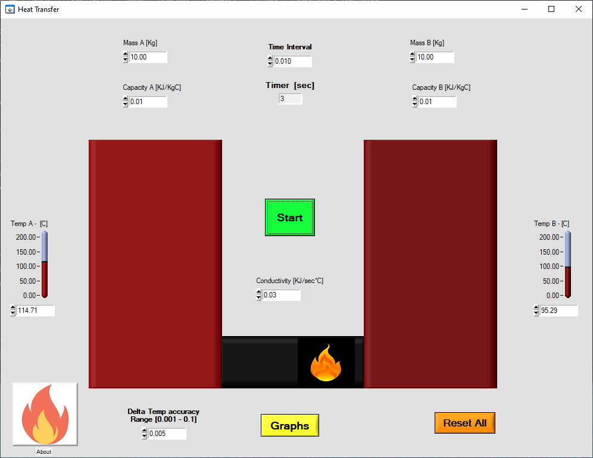
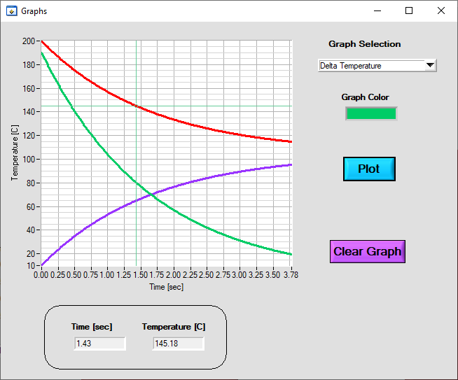

# HeatTransfer

Heat transfer graphical simulation for 2 objects in respect for their Mass [Kg], Capacity [KJ/KgC] and the Condctivity [KJ/sec*C].

The simulation will show the objects temperature during the heat transfer.

The simulation can be exported to a graph for further analysis.

Created for practice as part of my "Embedded systems" course during 3rd year of my BSc studies.

